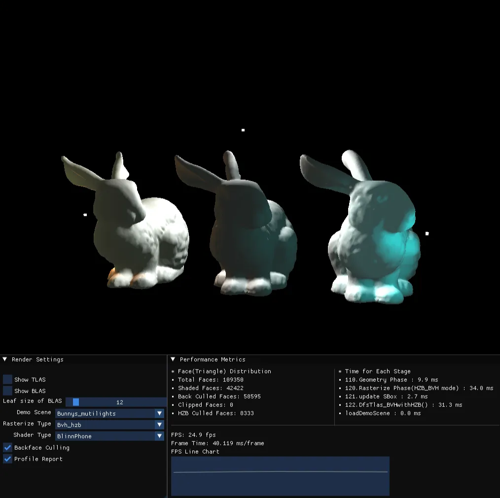

# 软光栅器和层次Z-Buffer的实现

# 1、项目概述

## 1.1 功能及代码结构概述

项目从底层实现了一个基础的软光栅器，在cpu端实现实时渲染。支持扫描线转换、层次zbuffer等剔除算法，采用BVH算法挖掘景物空间的连贯性，具体功能包括：

- 借助GLFW和OpenGL后端，搭建了实时可交互的windows界面。界面支持用户自定义相关渲染设置，如：渲染算法、shader种类、场景文件、bvh加速结构的可视化、bvh细粒度定义，上述修改均支持实时更新与反馈；界面会实时反馈每一帧的渲染开销等信息。
- 实现渲染管线。采用类OpenGL的状态机思想管理渲染管线的上下文，管线主要分为几何处理和光栅化阶段。其中几何处理阶段负责：MVP矩阵变换、背面剔除、视锥体裁剪算法，实现模型到屏幕空间的稳定的映射；光栅化阶段根据遍历对象的顺序的不同，分为顺序遍历和基于BVH结构启发式遍历两种方式，不同的渲染算法对应交互界面中的Naive、Bvh_hzb、Easy_hzb、Scan_convert四种选项。
- 实现了obj模型文件和纹理数据的读取和管理，采用BVH双层加速结构管理场景文件。所谓双层加速的BVH结构，其中底层加速结构(BLAS)管理唯一的obj模型，同一BLAS可以实例化为不同的对象（Instance），而顶层加速结构（TLAS）管理所有实例对象的所有属性。该结构一方面实现同一obj模型的内存复用，另一方面避免BLAS的冗余构建，且便于实时交互时的Instance属性动态更新。
- 实现多种基础的fragment shader，可渲染深度图、法向图、blinn-phone、线框图等，采用类似g-buffer的方式渲染多光源图。
- 实现不同的剔除算法。本项目的层次zbuffer算法能利用BVH的启发式遍历顺序，有效挖掘景物空间的连贯性，从而快速拒绝大量被遮挡景物。BVH结构在世界空间构建一次，随后实时渲染中只需基于相机视角视角，预先轻量维护屏幕空间的各个BVH结点的AABB盒，以支持实时的层次z-buffer算法。随后在光栅化阶段，总是选择屏幕空间z值更小的BVH节点作为优先遍历对象，以较大的期望近似层次z-buffer中的近到远的更新顺序。

项目界面图:



---

项目的结构及各文件的主要作用说明如下：

```cpp
SOFTRASTERIZER
├── assets                    // 模型文件和图片等资产
│   └── model/ 
├── bin                       // 编译输出(after compilation)
│   └── ...
├── build                     // 工程文件等(after compilation)
│   └── ...
├── external                  // 第三方库
│   └── ...
├── src                       // 项目源代码
│   ├── common                // 公共结构、工具函数等
|   │   └── ...
│   ├── softrender            // 软光栅器的核心渲染文件
|   │   ├── clipper.cpp       // 裁剪算法
|   |   ├── interface.cpp     // 实现 game loop
|   |   ├── interface.h       // 渲染管线与窗口的交互信号
|   |   ├── render.cpp
|   |   ├── render.h          // 项目的顶层类，管理pipeline状态
|   |   ├── scanline.cpp  
|   |   ├── scanline.h        // 扫描线转换算法
|   |   ├── shader.cpp
|   |   └── shader.h          // Vertex shader和Fragment shader
│   ├── as.h                  // 加速结构的声明      
│   ├── buffer.h              // 帧缓存和深度缓存 
│   ├── bvhbuilder.h          // bvh构建的具体实现   
│   ├── camera.h              // 相机
│   ├── hzb.h                 // 层次zbuffer
│   ├── light.h               // 光源定义
│   ├── main.cpp
│   ├── material.h            // 材质定义
│   ├── object.h              // 描述物体    
│   ├── scene_loader.h        // 场景管理的顶层类
│   ├── scenedemo.cpp         // 场景demo数据
│   ├── texture.h             // 纹理定义
│   ├── vertex.h              // 顶点定义
│   ├── window.h              // 可视化窗口定义
│   └── *.cpp                 // 许多cpp实现
├── CMakeLists.txt
├── setup_debug.bat
└── setup_release.bat
```

## 1.2 交互说明

直接运行程序后，可看到上图中展示的界面。

- 视角变换：鼠标左击屏幕可以移动摄像头视角；键盘WASD控制相机位置上下左右移动。
- 渲染属性调整：界面左下方的“Render Setting”中提供了部分目前可修改的值，用户可直接上手尝试。其中：
    - “Show TLAS”：展示顶层BVH结构；
    - “Show BLAS”：展示底层BVH结构；
    - “Leaf  size of BLAS” : 调整底层BVH的叶子节点至多包含的primitive数量；
    - “Demo Scene”：选择要渲染的demo场景；
    - “Rasterize Type”： 选择渲染算法；
    - “Shader Type”： 选择着色算法；
    - “Backface Culling”： 开关背面剔除；
    - “Profile Report”： 开关右侧性能指标；
- 渲染器实时性能变化：见右下方的“Performance Metrics”控件中的内容，包括：
    - 每一帧的帧率变化，以及pipeline各子阶段的计时器结果；
    - primitive的渲染情况分布，总的面数=渲染的面+背面剔除的面+被裁剪的面+HZB拒绝的面。可用于观测算法的实际性能。

## 1.3 开发环境说明

- 操作系统： windows11
- cpu型号： intel core i9
- 编译链：camke项目，支持多种编译链。本人开发中采用mingw64 v14.2.0版本的gcc和g++编译。
- 第三方库支持（见external文件夹）
    - glfw、glad、opengl：提供窗口构建和显示渲染，注意仅仅借助opengl将帧缓存绑定到矩形纹理中，最后渲染到窗口的viewport上，软光栅器未采用任何图形学接口；
    - glm：提供高效的矩阵和向量运算；
    - imgui: 通过即时渲染模式提供非常轻量和高效简易的图形界面，用来构建交互界面；
    - stb_image: 读取纹理数据的轻量库；
    - tiny_obj_loader: 读取obj格式模型的轻量库；

## 1.4 编译与运行

- windows

项目根目录下提供了windows的构建编译的脚本文件，直接在cmd窗口等windows终端中执行该脚本文件即可：

```cpp
cd path/to/project root
setup_release.bat          // 执行cmake等指令，需要先安装cmake环境
bin/srender                // 执行程序
```

- linux

```cpp
cd path/to/project root
mkdir build
cd build
cmake -DCMAKE_BUILD_TYPE=Release  -DCMAKE_C_COMPILER=/path/to/gcc -DCMAKE_CXX_COMPILER=/path/to/g++    ..
cmake --build .      // or: make ..
../bin/srender
```

看到根目录下有了bin文件夹，且其中生成目标可执行程序即编译成功。

# 2、 主要数据结构及算法设计

## 2.1 总体设计和数据结构介绍

下图简要展示了项目中主要的类，以及它们各自主要的数据成员。左侧（绿色）的各类负责场景文件的读取、场景资源的管理和场景加速结构的构建。右侧（灰色）的各类负责渲染管线的实现。下面依次介绍这些类及类间协同关系。


> 基础数据结构
> 
- Vertex类管理顶点数据，包括顶点的基本属性和几何变换中某些阶段的位置，比如保存世界坐标及世界坐标法向量用来计算光照，保存裁剪坐标用来执行裁剪算法。

```cpp
struct Vertex
{
    // model space properties
    glm::vec3 pos_;
    glm::vec3 norm_;
    glm::vec4 color_;
    glm::vec2 uv_;

    bool discard = false; // set this to true when the vertex is out of clip space
    glm::vec3 w_pos_;     // world space position
    glm::vec4 c_pos_;     // clip space position
    glm::vec3 s_pos_;     // screen space position  （ x,y in screen-space and z in [-1,1] where -1 is the near-flat
    glm::vec3 w_norm_;    // world space norm       
	  ·······
};
```

- Texture类，负责读取纹理，实现了双线性插值方法。

```cpp
class Texture{
public:
    Texture(std::string filename):channel_num_(4){
        loadFromFile(filename);
    }
    glm::vec4 operator[](uint32_t x);
    void loadFromFile(std::string filename);
    glm::vec4 getColorBilinear(float x,float y);
    ······

private:
    int width_;
    int height_;
    int pnum_;
    const int channel_num_;
    unsigned char* data_;
};

```

- Material类，负责读取纹理信息，保存三类材质属性。由该类直接管理材质使用的纹理数据。

```cpp
class Material{
public:
    void setADS(glm::vec3 am,glm::vec3 di,glm::vec3 sp,float shininess=1);
    void setName(std::string name){ name_= name; }
    void setTexture(MltMember mtype,std::string path);
    std::shared_ptr<Texture> getTexture(MltMember mtype)const;
    const glm::vec3 getAmbient()const{ return ambient_; }
    const glm::vec3 getDiffuse()const{ return diffuse_; }
    const glm::vec3 getSpecular()const{ return specular_; }
    const std::string getName()const{ return name_; }
    const float getShininess() const{ return shininess_;}

public:
    std::string name_;
    glm::vec3 ambient_;
    glm::vec3 diffuse_;
    glm::vec3 specular_;
    float shininess_=32;
    std::string ambient_path_;
    std::string diffuse_path_;
    std::string specular_path_;
    std::shared_ptr<Texture> amb_texture_=nullptr;
    std::shared_ptr<Texture> dif_texture_=nullptr;
    std::shared_ptr<Texture> spe_texture_=nullptr;
};
```

- Light类，是光源的抽象类，其派生类包括点光源和面光源两类。主要属性包括光源的种类和环境光、漫反射光、镜面反射光的辐照强度。

```cpp
class Light{
public:
    Light(){}
    Light(glm::vec3 am,glm::vec3 dif,glm::vec3 spe):ambient_(am),diffuse_(dif),specular_(spe){}
    virtual void getPointLight(glm::vec3& pos,float& c,float& li,float& quad){}
    virtual void getDirLight(glm::vec3& dir){}
    virtual ~Light() = default; 
public:
    LightType type_;
    // intensity of light
    glm::vec3 ambient_; 
    glm::vec3 diffuse_; 
    glm::vec3 specular_;
};
```

- Camera类，负责管理相机的位置、朝向、视锥体的视野范围、屏幕的大小等属性，并提供获取View和Perspective矩阵的成员函数。

```cpp
class Camera{
public:
	······
	glm::mat4 getViewMatrix()const;
	glm::mat4 getPerspectiveMatrix()const;
	glm::mat4 getViewportMatrix()const;
	······
private:
	glm::vec3 position_;
	glm::vec3 front_;	// real direction
	glm::vec3 right_;
	glm::vec3 up_;
	bool update_flag_=false;		// turn true when camera moves and turn false when checked by `needUpdateMatrices`
	float speed_=0.8f;
	float sensitivity_=0.1f;
	float yaw_=0.f;    // horizental
  float pitch_=0.f;  // vertical
	// define the image and near flat
	float fov_=60;	// vertical fov
	float aspect_ratio_=16.0/9.0;
	int image_width_,image_height_;
	float half_near_height_,half_near_width_;
	//for frustrum
	float near_flat_z_=1;
	float far_flat_z_=1000;
};
```

- ColorBuffer和DepthBuffer类，分别表示帧缓存和zbuffer，通过两个一维数组模拟。此外，DepthBuffer声明HZbuffer（层次zbuffer）为其友元类，从而使HZbuffer直接访问其私有成员zbuffer_。

```cpp
class ColorBuffer{
public:
    ColorBuffer(int width,int height):width_(width),height_(height){
        addr_=new unsigned char[width*height*4];
        pixel_num_=width*height;
    }
    void clear(const unsigned char num=0);
    void reSetBuffer(int width,int height);
    unsigned char* getAddr()const{return addr_;}
    inline void setPixel(int x,int y,glm::vec4 color)const;
    ~ColorBuffer();
private:
    int width_;
    int height_;
    // addr_:帧缓存起始地址，采用rgba四字节连续存储的方式表示一个像素的颜色，
    // viewport的地址（x，y）按照：左下角为（0,0），右上角为（width-1,height-1）
    unsigned char* addr_;
    int pixel_num_=0;
}; 

class DepthBuffer{
public:
    DepthBuffer(){};
    DepthBuffer(int width,int height){
        width_=width;
        height_=height;
        pixel_num_=width*height;
        zbuffer_.resize(width*height);
        std::fill(zbuffer_.begin(),zbuffer_.end(),1.0f);
    }
    inline void reSetBuffer(int width,int height);
    void clear();
    void setDepth(int x,int y,float depth);
    inline std::shared_ptr<std::vector<float>> getZbuffer();
    inline bool zTest(int x,int y,float depth);
    inline float getDepth(int x,int y);

private:
    int width_;
    int height_;
    int pixel_num_;
    std::vector<float> zbuffer_;

    friend class HZbuffer;
};
 
```

- Window类，借助GLFW和openGL后端建立和维护窗口，并借助imGui管理窗口中的交互控件，同时完成渲染管线和界面的信息交互。

```cpp
class Window{
public:
   ······
private:
    static void keyCallback(GLFWwindow* window, int key, int scancode, int action, int mods);
    static void mouseCallback(GLFWwindow* window, double xpos, double ypos);
    static void framebuffer_size_callback(GLFWwindow* window, int width, int height);

    GLFWwindow* window_;
    Render* render_;
    RenderIOInfo* info_;
    static ImGuiIO* io;
    unsigned int shaderProgram_;
    unsigned int width_ , height_;
    unsigned int texture_ , VAO_;
    
    float lastX_, lastY_; // 鼠标位置
    bool firstMouse_=true;     

    // 顶点着色器源代码
    const char* vertexShaderSource = R"(
        #version 330 core
        layout (location = 0) in vec2 aPos;
        layout (location = 1) in vec2 aTexCoord;
        out vec2 TexCoord;
        void main() {
            gl_Position = vec4(aPos, 0.0, 1.0);
            TexCoord = aTexCoord;
        }
    )";

    // 片段着色器源代码
    const char* fragmentShaderSource = R"(
        #version 330 core
        out vec4 FragColor;
        in vec2 TexCoord;
        uniform sampler2D screenTexture;
        void main() {
            FragColor = texture(screenTexture, TexCoord);
        }
    )";
};
```

> 场景资源管理
> 
- ObjectDesc类，管理obj文件数据，包括顶点属性、顶点索引、面片纹理属性、面片纹理索引等。由声明可知该类设计成了抽象类，但是其派生类目前还只实现了Mesh结构。其Mesh派生类在读取mesh结构时会主动执行三角剖分，因此最终保存在ObjecDesc类中的primitive都确保了是三角形。在数据管理方面，vertices_存储所有不同的顶点，indices_的索引指向顶点属性数组，其中连续三个索引表示一个面片。

```cpp
class ObjectDesc{
public:
    virtual void initObject(const tinyobj::ObjReader& reader,std::string filepath,bool flip_normals=false,bool backculling=true)=0;
    virtual void printInfo() const=0;
    virtual void clear()=0;
    inline std::vector<Vertex>& getVertices() { return vertices_;}
		····

protected:
    std::string name_;
    PrimitiveType type_;
    // all the information of vertices
    std::vector<Vertex> vertices_;  
    // contains indices to `vertices_`,and every three vertices constitude a face
    std::vector<uint32_t> indices_;
    // the normal for all faces, only availabel for MESH
    std::vector<glm::vec3> face_normals_;
    // all the information of materials
    std::vector<std::shared_ptr<Material>>mtls_;  
    // each triangle's material index pointer
    std::vector<int> mtlidx_;
    // the total number of faces, hence vertices num is trible
    unsigned long long face_num_=0;  
    bool do_back_culling_=true;
};
```

- BVHnode类，表示一个bvh节点。我采用静态数组的方式实现树结构，没有采用更直观的二叉指针是因为前者在内存上紧凑，更容易管理且在cache层面效率更高。该类拥有一个三维的aabb盒子，用来表示包围盒；属性primitive_start和primitive_num则表示该包围盒所描述的元素在该元素数组中的起始位置和跨度（数量）。

```cpp
struct BVHnode
{
    int left;
    int right;
    AABB3d bbox;    // box in world or local space, pre-calculated when obj file is loaded.
    // specify which elements do this node control.
    unsigned int prmitive_start;
    unsigned int primitive_num ;
    BVHnode():left(-1),right(-1),prmitive_start(0),primitive_num(0){}
};

```

- BVHbuilder类，封装了执行BVH树构建的方法。同时支持BLAS和TLAS两种结构的BVH构建。构建的结果存在成员nodes_中，该成员由unique指针独占，在构建完后，将所有权转移到ASInstance对象或者TLAS对象。此外，BVH树的根节点存放在nodes[0]，priboxes_是在构树之前预先为所有元素计算包围盒的辅助数组。对于BLAS，存储所有三角形面的包围盒；对于TLAS，存储所有ASInstance的包围盒。

```cpp
class BVHbuilder
{
public:
    BVHbuilder()=delete;
    // building bvh tree for BLAS
    BVHbuilder(std::shared_ptr<ObjectDesc> obj,uint32_t leaf_size);
    // building bvh tree for TLAS
    BVHbuilder(const std::vector<ASInstance>& instances);
    // building implemention
    int buildBVH(uint32_t start,uint32_t end);
    bool cmp(uint32_t a, uint32_t b,int axis);
    std::unique_ptr<std::vector<BVHnode>> moveNodes(){ return std::move(nodes_); }
    std::vector<uint32_t>& getPridices(){ return pridices_; }
    
public:
    std::unique_ptr<std::vector<BVHnode>> nodes_;        // root node is the nodes_[0].
    std::vector<uint32_t> pridices_;    // primitives_indices_
    std::vector<AABB3d> priboxes_;      // bbox for each element
    uint32_t leaf_size_=4;
};
```

- BLAS类，即底层加速结构，描述一个obj模型的BVH层次结构。该层次结构是在物体空间一次性构建的，其数据成员object_指向原本的模型结构，tree_则是构建的bvh树。而primitives_indices_中存储的是指向object_的面片索引的索引数组。即，每个tree_中的BVHnode对象通过“primitive_start和primitive_num”指向BLAS的primitives_indices_数组中的从primitive_start开始的primitive_num个索引，这些索引又指向实际的ObjectDesc中的面片。

```cpp
class BLAS
{
public:
    BLAS()=delete;
    BLAS(std::shared_ptr<ObjectDesc> obj,uint32_t leaf_size);
public:
    std::shared_ptr<ObjectDesc> object_;
    std::unique_ptr<std::vector<BVHnode>> tree_;                   // nodes_ points to  primitives_indices_
    std::unique_ptr<std::vector<uint32_t>> primitives_indices_;     // primitives_indices_ points to object_'s primitive
};
```

- ASInstance类，描述底层加速结构的实例对象。由于经常出现一个场景中某一个obj文件重复出现多次的情况，为了避免多次加载同一模型到内存且重复构建BLAS的情况，所以采用该结构来实例化BLAS。即，ASInstance会绑定BLAS，且多个ASInstance可以重复绑定同一BLAS，同时，每个实例对象又能保存独立的属性，比如shader种类、变换到世界坐标的模型矩阵和世界坐标AABB盒。这种设计类似于类的抽象和派生，极大程度实现了数据的复用，且在c++智能指针的帮助下，这种复用能够安全的实现。我在数据成员中还保存了3个指向不同vector数组的unique指针，其作用暂且不表，其性质是逐帧更新的暂存数组。

```cpp
class ASInstance{
public:
    ASInstance(std::shared_ptr<BLAS>blas,const glm::mat4& mat,ShaderType shader):blas_(blas),modle_(mat),shader_(shader);
    void refreshVertices();
    void BLASupdateSBox();
    void updateScreenBox(int32_t node_idx,std::vector<BVHnode>&blas_tree,std::vector<uint32_t>& primitive_indices);
public:
    std::shared_ptr<BLAS> blas_;
    // preserve properties for each frame after clipping.
    std::unique_ptr<std::vector<Vertex>> vertices_;
    std::unique_ptr<std::vector<PrimitiveHolder>> primitives_buffer_;
    std::unique_ptr<std::vector<AABB3d>> blas_sboxes_;

    glm::mat4 modle_;
    AABB3d worldBBox_;
    ShaderType shader_;
};
```

- TLAS类，即顶层加速结构，负责直接管理所有ASInstance，并为其构造BVH结构。

```cpp
class TLAS
{
public:
    TLAS():tree_(std::make_unique<std::vector<BVHnode>>()),tlas_sboxes_(std::make_unique<std::vector<AABB3d>>()){}
    void buildTLAS();
    void TLASupdateSBox();
    void updateScreenBox(int32_t node_idx);
    
public:
    std::vector<ASInstance> all_instances_;
    std::unique_ptr<std::vector<BVHnode>> tree_;
    std::unique_ptr<std::vector<AABB3d>> tlas_sboxes_;
};
```

- Scene类，管理场景资源的顶层模块，直接指向场景的TLAS。该类在顶层发号施令，通过调用addObjInstance函数，完成obj的读取、blas的构建、ASInstance的构建。此外，采用了一个map容器来记录obj-filename和BLAS的对应关系，从而确保同一obj文件只被保存和构建一次。在场景加载完所有obj文件后，调用buildTLAS即可完成TLAS的BVH构建。场景中当然还有光源，对于光源实例，为了后续多光源渲染的高效，单独采用vector存储所有光源指针。

```cpp
class Scene{
public:
    Scene():tlas_(std::make_unique<TLAS>()){};
    // create BLAS for obj if it hasn't been built.
    void addObjInstance(std::string filename, glm::mat4& model,ShaderType shader,bool flipn=false,bool backculling=true);
    void buildTLAS();
    inline void clearScene();
    // when leaf_num is changed, blas should be rebuilt.
    void rebuildBLAS();
		······
    
private:
    
    std::unique_ptr<TLAS> tlas_;            // TLAS->AS->BLAS->objectdesc
    std::unordered_map<std::string,std::shared_ptr<BLAS> > blas_map_;    
    int leaf_num_=4;
    int vertex_num_;
    int face_num_;
    // lights
    std::vector<std::shared_ptr<Light>> all_lights_;
};
```

> 渲染管线相关类
> 
- RenderIOInfo类，负责管线状态管理。其成员包括RenderSetting、PerCnt、CPUTimer三个类的对象。用于Render类与Window类之间的消息传递，实施逐帧更新。
    - RenderSetting类负责管理程序应用界面的用户设置；
    - PerCnt和CPUTimer负责管理当前帧的管线执行情况。

```cpp
struct RenderSetting{
    bool show_tlas=false;
    bool show_blas=false;

    std::string scene_filename="";
    bool scene_change=false;       

    int bvh_leaf_num;
    bool leaf_num_change=false;

    ShaderType shader_type=ShaderType::Depth;
    bool shader_change=false;

    RasterizeType rasterize_type=RasterizeType::Naive;
    bool rasterize_change=false;
    
    bool back_culling=true;
    bool profile_report=true;

    // always true
    bool earlyz_test=true;
};

struct PerfCnt{
    int total_face_num_=0;
    int shaded_face_num_=0;
    int back_culled_face_num_=0;
    int clipped_face_num_=0;
    int hzb_culled_face_num_=0;
};

struct RenderIOInfo{
    RenderSetting setting_;
    PerfCnt profile_;
    CPUTimer timer_;
};
```

- Render类，负责管理渲染管线的状态，组织渲染管线的流程，同时实现了除vertex shader和fragment shader外的其他渲染流程。
    - 渲染管线的状态通过成员 RenderIOInfo info_控制，该成员的内存区作为和window类的共用区域，从而实现简易的消息传递机制。
    - 渲染管线的组织由成员函数pipelineBegin()执行，根据景物遍历方式的不同又可分为pipelineRasterizePhasePerInstance()和pipelineRasterizePhaseHZB_BVH()两种方法，这两条渲染管线都会经历共同的几何处理阶段pipelineGeometryPhase()，以及各自的光栅化阶段。
    - GameLoop()函数中实现了实时渲染循环，作为程序的主流程。
    - pipelineGeometryPhase()作为几何处理阶段，首先会调用Shader类的vertex shader的一部分，完成物体空间顶点数据到裁剪空间的变换，然后在裁剪空间实施裁剪算法，最后将裁剪后的结果再次传入Shader类，将裁剪空间的顶点变换到屏幕空间。
    - 光栅化阶段的函数最终的渲染接口是drawTriangleNaive()、drawTriangleHZB()、drawTriangleScanLine()等，这些函数会调用Shader类的fragment shader，完成透视矫正插值和着色算法。

```cpp
class Render{
public:
    Render():camera_(),colorbuffer_(std::make_shared<ColorBuffer>(camera_.getImageWidth(),camera_.getImageHeight())),
            zbuffer_(std::make_shared<DepthBuffer>(camera_.getImageWidth(),camera_.getImageHeight())),
            info_(),setting_(info_.setting_ ),timer_(info_.timer_),profile_(info_.profile_);

    // MEMBER SETTING
    inline void setCamera(glm::vec3 pos,glm::vec3 lookat,glm::vec3 right,float fov=60,float ratio=16.0/9.0,int image_width=1000);
    inline void setViewport(uint32_t width,float ratio,float fov);
    void setBVHLeafSize(uint32_t num);
    void addObjInstance(std::string filename,glm::mat4& model,ShaderType shader,bool flipn=false,bool backculling=true);
    inline void setDeltaTime(float t);
    void updateMatrix();
    inline void updateViewMatrix();
    inline void cleanFrame();
    inline  Camera& getCamera();
    inline const ColorBuffer& getColorBuffer()const;
    inline const Scene& getScene()const;

    // PIPELINE
    void pipelineInit();
    void pipelineBegin();
    void pipelineGeometryPhase();
    void pipelinePerInstance();
    void pipelineRasterizePhasePerInstance();
    void pipelineHZB_BVH();
    void pipelineRasterizePhaseHZB_BVH();
   
    void cullingTriangleInstance(ASInstance& instance,const glm::mat4 normal_mat);
    int pipelineClipping(std::vector<Vertex>& v,std::vector<Vertex>& out);
    void clipWithPlane(ClipPlane plane,std::vector<Vertex>&in,std::vector<Vertex>&out);
    bool backCulling(const glm::vec3& face_norm,const glm::vec3& dir)const;

    // INTERFACE
    void GameLoop();
    void handleKeyboardInput(int key, int action);
    void handleMouseInput(double xoffset, double yoffset);
    void moveCamera();

    // DEBUG
    void showTLAS();
    void showBLAS(const ASInstance& inst);
    void loadDemoScene(std::string name,ShaderType shader);
    void printProfile();
private:
    // rasterize
    void drawPoint(const glm::vec2 p, float radius,const glm::vec4 color);
    void drawLine(glm::vec2 t1,glm::vec2 t2);
    void drawLine3d(glm::vec3 t1,glm::vec3 t2,const glm::vec4& color=glm::vec4(255));
    void drawTriangleNaive();
    void drawTriangleHZB();
    void drawTriangleScanLine();

    void traverseBVHandDraw(const std::vector<BVHnode>& tree,uint32_t nodeIdx,bool is_TLAS,const glm::mat4& model=glm::mat4(1.0));
    void DfsTlas_BVHwithHZB(const std::vector<BVHnode>& tree,std::vector<AABB3d> &tlas_sboxes,const std::vector<ASInstance>& instances,uint32_t nodeIdx);
    void DfsBlas_BVHwithHZB(const ASInstance& inst,int32_t nodeIdx);
    void afterCameraUpdate();// update members accrordingly after camera's update

    void initRenderIoInfo();

private:
    bool is_init_=false;

    std::shared_ptr<Shader> sdptr_;
    std::shared_ptr<ScanLine::PerTriangleScanLiner> tri_scanliner_;
    Camera camera_;
    std::shared_ptr<ColorBuffer> colorbuffer_;
    std::shared_ptr<DepthBuffer> zbuffer_;
    std::shared_ptr<HZbuffer> hzb_;
    Scene scene_;
    
    glm::mat4 mat_view_;        // model to world
    glm::mat4 mat_perspective_; // world to NDC
    glm::mat4 mat_viewport_;    // NDC to screen

    AABB2d box2d_;                // screen aabb box
    AABB3d box3d_;              

public:
    float delta_time_;          // time spent to render last frame; (ms)
    bool keys_[1024]={0}; 
    RenderIOInfo info_;
    RenderSetting& setting_;
    CPUTimer& timer_;            // (us)
    PerfCnt& profile_;
};
```

- Shader类，在渲染管线中实施Vertex shader和Fragment shader。学习OpenGL中的阶段划分，将这两个允许自定义的阶段从Render中抽离出，单独封装为Shader类。该类不仅提供shader方法，还要实施shader上下文的管理和fragment的属性插值算法。

```cpp
class Shader{
public:
    Shader(){}
  
    inline void bindMVP(const glm::mat4* m){ mvp_=m;}
    inline void bindViewport(const glm::mat4* m){ viewport_=m;}
    inline void bindNormalMat(const glm::mat4* m){ normal_mat_=m;}
    inline void bindModelMat(const glm::mat4* m){ model_mat_=m;}
    inline void bindMaterial(std::shared_ptr<Material> mp){ material_=mp; }
    inline void bindCamera(std::shared_ptr<Camera> cp){ camera_=cp; }
    inline void bindLights(const std::vector<std::shared_ptr<Light>>& light){ lights_=light; }
    inline void bindTimer(CPUTimer* t){ timer_=t; }
    inline void bindFragmentHolder(const FragmentHolder& f){content_.bindFragment(f);}

    inline void setShaderType(ShaderType st);
    inline void setPrimitiveType( PrimitiveType t);
    inline void setFrustum(int near,int far);
    inline ShaderType getType()const{ return type_;}
    inline glm::vec4 getColor()const { return content_.color; }
    inline float getDepth() const { return content_.depth; }
    inline glm::vec3 getScreenPos(uint32_t idx) const { return content_.v[idx]->s_pos_; }
    inline Vertex* getVertices(uint32_t idx) { return content_.v[idx]; }

    inline bool checkShader(ShaderType flag);
    inline bool checkInterpSign(InterpolateSignal flag);

    inline void assemblePrimitive(Vertex* v1, Vertex* v2, Vertex* v3);

    void vertexShader(Vertex& v );
    void vertex2Screen(Vertex& v );
    void fragmentShader(uint32_t x,uint32_t y);
    void fragmentInterp(uint32_t x,uint32_t y);
    float fragmentDepth(uint32_t x,uint32_t y);
    void fragmentShader(FragmentHolder& fragment );

    // different shaders
    void blinnphoneShader(Material& mtl);
    void textureShader();
    void colorShader();
    void depthShader();
    void normalShader();
    void lightShader();

    // light calculation 
    void shadeDirectLight(const DirLight& light,const glm::vec3& normal,const glm::vec3& eyepos,const glm::vec3& fpos,const Material& mtl);
    void shadePointLight(const PointLight& light,const glm::vec3& normal,const glm::vec3& eyepos,const glm::vec3& fpos,const Material& mtl);

private:
    ShaderContentRecord content_;
    ShaderType type_;
    InterpolateSignal interp_sign_;

    const glm::mat4 * mvp_;
    const glm::mat4 * viewport_;     
    const glm::mat4 * normal_mat_;    // m^(-1)*T
    const glm::mat4 * model_mat_;    
    std::shared_ptr<Material> material_;
    std::vector<std::shared_ptr<Light>> lights_;
    std::shared_ptr<Camera> camera_;

    float far_plane_;
    float near_plane_;
};
```

- ShaderContentRecord结构，负责管理Shader类的上下文。比如在执行shader前需要绑定primitive的类型和顶点指针，然后将插值结果记录在该结构体中，最后得到fragment的渲染颜色，并将其写入到帧缓存中。

```cpp
struct ShaderContentRecord{

    // vertex shader output
    Vertex* v[3];
    PrimitiveType primitive_type; 

    //---after interpolation----

    // fragment shader input
    float depth;            // ndc depth
    glm::vec3 normal;       // world normal
    glm::vec3 vbary;        // barycenter in view space
    glm::vec3 fragpos;      // world position
    glm::vec2 uv;
    glm::vec4 in_color;
   
    // fragment shader output
    glm::vec4 color;
};
```

- ScanLiner类，由于扫描线转换算法的独特性，所以单独用一个类实现了其渲染流程，数据成员的定义按照一般的标准，其作用不再赘述。

```cpp
class ScanLiner{
public:
		···
protected:
    bool init_=false;
    std::vector<PrimitiveNode> PT_;
    std::vector<EdgeNode> ET_;
    std::vector<std::vector<uint32_t>> idx2ET_; // Y->ET indices
    std::vector<std::vector<uint32_t>> idx2PT_;//  Y->PT indices

    std::vector<PrimitiveNode*> APT_;
    std::vector<EdgeNode*> AET_;

    // buffers will not be cleared but updated directly. if we need to clean, clean them outside. 
    std::shared_ptr<ColorBuffer> fbuffer_;
    std::shared_ptr<DepthBuffer> zbuffer_;

    AABB2d screen_box_;
 }
```

综上所述，这一节陈列了项目中主要的数据结构。下面基于这些结构，介绍项目中的主要算法。

## 2.2 双层BVH加速结构的构建

项目目前采用BVH结构来挖掘景物空间的连贯性，且参考DirectX的两级加速结构手写了基于BVH的分层加速结构。这一结构能够在大规模场景中更好的复用相同的几何体，并且简化动态对象的更新过程。

- **BLAS（Bottom-Level Acceleration Structure）**：对单个几何体（或网格）构建的加速结构。
- **TLAS（Top-Level Acceleration Structure）**：对场景中所有几何体或 BLAS 实例的包围盒进行组织，实现全局层面的加速查询。

相关结构的具体实现在源码中的as.h和as.cpp中。

此处仅以顶层接口展示场景的大致构建流程：

- 函数Scene::addObjInstance的作用是基于obj文件路径和其他针对该物体的渲染设置完成ASInstance的构建。
    - 首先会检查一个map来确定是否曾经已经构建过该obj模型，如果没有构建过则借助工具类ObjLoader来读取obj文件；
    - 随后为该obj文件创建BLAS结构，再为该BLAS结构构建ASInstance结构，如果对于具体的构建过程感兴趣，欢迎查看源码中相应部分的函数~
- 在添加完所有obj模型后，还需要调用Scene::buildTLAS函数完成一次顶层加速结构的构建

```cpp
  void Scene::addObjInstance(std::string filename, glm::mat4& model,ShaderType shader,bool flipn=false,bool backculling=true){
      if(blas_map_.find(filename)==blas_map_.end()){
          // read from objfile
          ObjLoader objloader(filename,flipn,backculling);
          std::shared_ptr<ObjectDesc> obj=std::move(objloader.getObjects());
          // create blas
          blas_map_[filename]=std::make_shared<BLAS>(obj,leaf_num_);

          objloader.updateNums(vertex_num_,face_num_);
          std::cout<<"Current vertex num: "<<vertex_num_<<std::endl;
          std::cout<<"Current face num: "<<face_num_<<std::endl;
      }
      // create ASInstance for obj
      tlas_->all_instances_.emplace_back( blas_map_[filename],model,shader );
  }
  void Scene::buildTLAS(){
      tlas_->buildTLAS();
  }
```

TLAS和BLAS的BVH结构构建构建过程类似。以TLAS为例，TLAS::buildTLAS()会调用工具类BVHbuilder，该类的相关具体实现请查看源代码中bvhbuilder.cpp中函数BVHbuilder::buildBVH(…)和BVHbuilder的构造函数。

```cpp
  void TLAS::buildTLAS(){
      if(all_instances_.size()){
          BVHbuilder builder(all_instances_);
          tree_=builder.moveNodes();
      }
      tlas_sboxes_->resize(tree_->size());
  }
```

最后，构建好的加速结构存储在Scene类的数据成员tlas_中。我们可以直接取出tlas_的std::vector<ASInstance> all_instances_进行景物的顺序遍历，也可以结合std::unique_ptr<std::vector<BVHnode>> tree_和std::vector<ASInstance> all_instances_进行景物的树型遍历。

## 2.3 渲染管线的设计与实现

主程序的game loop放在interface.cpp下的void Render::GameLoop()中，但是在执行管线渲染循环之前，需要先初始化管线属性。比如初始化默认场景和默认管线设置、初始化相关动态内存申请的指针等。这些操作都放在函数void Render::pipelineInit()中。在调用完初始化函数后终于可以进入到pipeline的执行了。

### 2.3.1 几何变换阶段

项目中的管线提供了一种统一的几何变换方法。算法流程如下所示。函数采用逐ASInstance的方式进行几何变换，首先初始化顶点着色器，然后将顶点变换到裁剪空间，在裁剪空间中执行了视锥体裁剪和背面剔除两种剔除算法。最后再将所有视锥体内部的顶点通过透视除法和视口变换，最终得到屏幕空间的所有顶点。

```cpp
void Render::pipelineGeometryPhase(){
    auto& asinstances=scene_.getAllInstances();
    for(auto& ins:asinstances){

        auto& obj=ins.blas_->object_;
        auto& mat_model=ins.modle_;

        // init vertex shader
        glm::mat4 mvp=mat_perspective_*mat_view_*mat_model;
        glm::mat4 normal_mat=glm::transpose(glm::inverse(mat_model));
        sdptr_->bindMVP(&mvp);
        sdptr_->bindViewport(&mat_viewport_);
        sdptr_->bindNormalMat(&normal_mat);
        sdptr_->bindModelMat(&mat_model);

        // MVP => clip space
        for(auto& v:obj->getVertices()){   
            sdptr_->vertexShader(v);
        }

        // culling 
        cullingTriangleInstance(ins,normal_mat);

        // clip space => NDC => screen space 
        for(auto& newv:*ins.vertices_){
            sdptr_->vertex2Screen(newv);
        }
    }
}
```

- vertex shader，如下所示。

```
/**
 * @brief vertex shader: convert vertex from model-space to screen-space 
 *        => x and y in [width,height], z in [-1,1];
 * @param v : the vertex information holder
 */
void Shader::vertexShader(Vertex& v ){
    v.c_pos_=(*mvp_)*glm::vec4(v.pos_,1.0f);
    if(v.c_pos_.w>1e-6 && INSIDE(v.c_pos_.x,v.c_pos_.y,v.c_pos_.z,v.c_pos_.w)){
        v.discard=false;
        // record word postion and normal to shade color.
        v.w_pos_=(*model_mat_)*glm::vec4(v.pos_,1.0f);      
        v.w_norm_=(*normal_mat_)*glm::vec4(v.norm_,0);   
    }
    else{   
        // need to be clipped
        v.discard=true;
    }
}

void Shader::vertex2Screen(Vertex& v ){
    // perspective division and viewport transformation
    v.s_pos_=(*viewport_)*(v.c_pos_/v.c_pos_.w);     
}
```

- 重点说明一下裁剪空间中剔除算法的顶层逻辑，cullingTriangleInstance函数。
    - 剔除算法的主要流程是，对于每个ASInstance的每个面，首先执行背面剔除，如果没有被剔除，则执行视锥体裁剪。
    - 类Cohen-Sutherland的三维算法：视锥体裁剪前，先计算其outcode（空间划分为27份进行编码），希望能够快速拒绝和快速接受。如不能判定，则执行裁剪算法。对于其他裁剪相关的具体实现感兴趣，可去源码clipper.cpp中查看。

```cpp
// backculling and frustrum culling
void Render::cullingTriangleInstance(ASInstance& instance,const glm::mat4 normal_mat){
    instance.refreshVertices();
    // Omit some variable references here
    ...

    // reserve some space
    out_vertices.reserve(ver_num+100);
    out_mtlidx.reserve(face_num+30);
    out_primitives_buffer.reserve(primitive_num+10);

    // define clipping order
    std::vector<ClipPlane> planes = {...};
	  // clipping each triangle.
    for(int indices_offset=0;indices_offset<idx_num;indices_offset+=3){
        int face_cnt=indices_offset/3;

        uint32_t idx1=in_indices[indices_offset+0];
        uint32_t idx2=in_indices[indices_offset+1];
        uint32_t idx3=in_indices[indices_offset+2];

        auto& v1=in_vertices[idx1];
        auto& v2=in_vertices[idx2];
        auto& v3=in_vertices[idx3];

        /* ---------------- back culling ---------------- */
        if(setting_.back_culling&&obj->isBackCulling()){

            glm::vec3 norm=normal_mat*glm::vec4(objfacenorms[face_cnt],0.f);
            glm::vec3 dir=camera_.getPosition()-v1.w_pos_;
            if(backCulling(norm,dir)==true){
                ++profile_.back_culled_face_num_;
                out_primitives_buffer.emplace_back(ClipFlag::refused,-1,0, 0);
                continue;
            }
        }

        /* -------------- frustrum culling -------------- */
        // get outcode
        int outcode1 = ClipTools::computeOutcode(v1.c_pos_);
        int outcode2 = ClipTools::computeOutcode(v2.c_pos_);
        int outcode3 = ClipTools::computeOutcode(v3.c_pos_);

        int outcode_OR = outcode1 | outcode2 | outcode3;
        int outcode_AND = outcode1 & outcode2 & outcode3;

        // rapid reject
        if (outcode_AND != 0) {
            ++profile_.clipped_face_num_;
            out_primitives_buffer.emplace_back(ClipFlag::refused,-1,0,  0);
            continue;
        }

        // rapid accept
        if (outcode_OR == 0) {
            out_primitives_buffer.emplace_back(ClipFlag::accecpted,in_mtlidx[face_cnt], out_vertices.size(),3);
            out_vertices.emplace_back(v1);
            out_vertices.emplace_back(v2);
            out_vertices.emplace_back(v3);
            out_mtlidx.emplace_back(in_mtlidx[face_cnt]);
            continue;
        }

        std::vector<Vertex> input{v1,v2,v3};
        std::vector<Vertex> temp;

        bool clipflag=false;
        for (const auto& plane : planes) {// TODO: use mask to reduce unneccessary clipping
            temp.clear();
            clipWithPlane(plane, input, temp);
            input = std::move(temp);
            if (input.empty()) {
                clipflag=true;
                break;
            }
        }
        // totally clipped out
        if(clipflag){
            ++profile_.clipped_face_num_;
            out_primitives_buffer.emplace_back(ClipFlag::refused,-1, 0,0);
            continue;
        }

        int vnum = input.size();
        if (vnum < 3){
             ++profile_.clipped_face_num_;
            out_primitives_buffer.emplace_back(ClipFlag::refused,-1,0, 0);
            continue;
        }

        // been clipped into pieaces
        int vertex_start_pos=out_vertices.size();
        for (int i = 1; i < vnum - 1; ++i) {
            out_vertices.emplace_back(input[0]);
            out_vertices.emplace_back(input[i]);
            out_vertices.emplace_back(input[i + 1]);

            out_mtlidx.emplace_back(in_mtlidx[face_cnt]);
        }
        profile_.total_face_num_+=vnum-3;
        out_primitives_buffer.emplace_back(ClipFlag::clipped, in_mtlidx[face_cnt],vertex_start_pos,3*(vnum-2));
}
```

### 2.3.2 光栅化阶段

- 未利用BVH的做法：Render::pipelineRasterizePhasePerInstance()
    - 执行逻辑相对简单，取出所有ASInstacne，然后逐实例逐面片进行光栅化。
        
        ```cpp
         for(auto& ins:asinstances){
        	 // for each primitive
              int face_cnt=0;
              for(auto it=objvertices.begin();it<objvertices.end();face_cnt++){
        	      ......
              }
         }
        ```
        
    - 根据光栅化算法的不同又进入不同的三角形面片渲染函数中。比如drawTriangleHZB()执行使用层次zbuffer， drawTriangleNaive()直接使用zbuffer，drawTriangleScanLine()则使用扫描线转换。具体的函数实现细节在render.cpp中。

- 利用BVH的做法：Render::pipelineRasterizePhaseHZB_BVH()
    - 利用bvh结构挖掘景物空间的连贯性。首先要更新加速结构中每个节点在屏幕空间的包围盒（记为sbox），大致逻辑是DFS遍历：从每个BLAS的每个叶子节点开始向上更新sbox，基于被裁剪后得到的`std::unique_ptr<std::vector<PrimitiveHolder>> primitives_buffer_` 得到BVHnode所包含的新的面片集合，然后计算其sbox。之后DFS回溯更新上层sbox的值。这一过程是渲染前的预遍历，时间复杂度为0(2*n)，其中n为叶子节点的个数，单位操作为更新AABB的min和max值。
    - 随后，从TLAS的BVH树的根节点开始，开始深度优先遍历，并利用层次Z-buffer快速拒绝部分包围盒。
        
        ```cpp
        void Render::pipelineRasterizePhaseHZB_BVH(){
        
            // update bvh in screenspace
            auto& tlas=scene_.getTLAS();
            auto& tlas_tree=(*tlas.tree_);
            tlas.TLASupdateSBox();
            auto& tlas_sboxes=*tlas.tlas_sboxes_;
            
            DfsTlas_BVHwithHZB(tlas_tree,tlas_sboxes,scene_.getAllInstances(),0);
        }
        ```
        
    - DfsTlas_BVHwithHZB()的大致流程为：
        - 先执行层次Z-buffer的判定，如果没有被拒绝则深入下一层次，每次遍历的顺序是选取sbox的z值较小的盒子优先遍历，相当于由近到远更新层次Z-buffer。
        - 当TLAS抵达叶子节点，则进入DfsBlas_BVHwithHZB()递归入口，即深搜BLAS的BVH树，其基本过程与深搜TLAS类似，区别是：当抵达BLAS的叶子节点时，执行三角形的渲染算法。即一层层结构的包围盒都没有被层次Z-buffer快速拒绝，因此可以使用朴素的z-buffer来渲染。
    
    ```cpp
    void Render::DfsTlas_BVHwithHZB(const std::vector<BVHnode>& tree,std::vector<AABB3d> &tlas_sboxes,const std::vector<ASInstance>& instances,uint32_t nodeIdx){
    
         if(nodeIdx>=tree.size()){
            std::cerr<<"Render::DfsTlas_BVHwithHZB: nodeIdx>=tree.size()!\n";
            exit(-1);
        }
    
        auto& node=tree[nodeIdx];
    
        // IF the box is refused by HZB
        if(hzb_->rapidRefuseBox(tlas_sboxes[nodeIdx])){
            return;
        }
        
        // ELSE dive deeper...
        if(node.left>0&&node.right>0){
            // select a nearer node as a prior candidate
            AABB3d sbox_left=tlas_sboxes[node.left];
            AABB3d sbox_right=tlas_sboxes[node.right];
            if(sbox_left.min.z<sbox_right.min.z){
                DfsTlas_BVHwithHZB(tree,tlas_sboxes,instances,node.left);
                DfsTlas_BVHwithHZB(tree,tlas_sboxes,instances,node.right);
            }
            else{
                DfsTlas_BVHwithHZB(tree,tlas_sboxes,instances,node.right);
                DfsTlas_BVHwithHZB(tree,tlas_sboxes,instances,node.left);
            }
        }
        else if(node.left==-1&&node.right==-1){
            auto& inst=instances[node.prmitive_start];
            auto otype=inst.blas_->object_->getPrimitiveType();
    
            sdptr_->setShaderType(inst.shader_);
            sdptr_->setPrimitiveType(otype);
            assert(otype==PrimitiveType::MESH);
    
            DfsBlas_BVHwithHZB(inst,0);
        }
        else if(node.left==-1&&node.right!=-1){
            DfsTlas_BVHwithHZB(tree,tlas_sboxes,instances,node.right);
        }
        else if(node.right==-1&&node.left!=-1){
            DfsTlas_BVHwithHZB(tree,tlas_sboxes,instances,node.left);
        }
    }
    ```
    

- 朴素Z-buffer和层次Z-buffer的光栅化着色
    
    上述两种深度测试算法，不论是哪一种，最终确定要光栅化的三角形都将进行相同的光栅化算法。首先，取三角形的屏幕空间包围盒sbox内的每一个fragment，求出其重心坐标；随后，对于在三角形内的点，求出其深度，如果通过测试则进行该fragment的着色；最后，着色的实现交给了Shder中的Shader::fragmentShader(uint32_t x,uint32_t y)函数，代码如下。
    
    ```cpp
    void Shader::fragmentShader(uint32_t x,uint32_t y){
    
        assert(content_.primitive_type==PrimitiveType::MESH);
        /*--------------------- Interpolate ---------------------*/
        fragmentInterp(x,y);
    
        /*---------------------   Shading   ---------------------*/
        if(checkShader(ShaderType::Texture)&&material_)                               
            textureShader();
        else if(checkShader(ShaderType::Color))
            colorShader();
        else if(checkShader(ShaderType::Depth))
            depthShader();
        else if(checkShader(ShaderType::Normal))
            normalShader();
        else if(checkShader(ShaderType::Light))
            lightShader();
    
        content_.color=glm::clamp(content_.color,glm::vec4(0),glm::vec4(255.0));
    }
    ```
    

- 扫描线转换算法的光栅化着色
    
    由于扫描线转换算法本身独特的光栅化逻辑，所以单独实现在ScanLiner类中。其算法思想是：先光栅化多边形的边，保证每一y值只有偶数个点。然后对于每一扫描线，其自左向右遍历，并借助bool标记符号反映当前pixel是否在三角形上，以此来光栅化每一对点之间的所有pixels。这一思想最大的优势是利用了像素空间的连贯性，无需再对每一个fragment的属性进行重心插值，而是直接在扫描线顺序扫描的过程中进行“增量更新”，而且不同扫描线之间完全独立，方便进行多线程优化。
    
    因此，为其单独写了一个fragment shader，用FragmentHolder直接存储增量更新的每一个fragment的属性。
    
    ```cpp
    void Shader::fragmentShader(FragmentHolder& fragment ){
        bindFragmentHolder(fragment);
        if  (checkShader(ShaderType::Texture)&&material_)                               
            textureShader();
        else if(checkShader(ShaderType::Color))
            colorShader();
        else if(checkShader(ShaderType::Depth))
            depthShader();
        else if(checkShader(ShaderType::Normal))
            normalShader();
        else if(checkShader(ShaderType::Light))
            lightShader()；
        // color processing...
        for(int i=0;i<3;++i){
            content_.color[i]=std::min(255.f,content_.color[i]);
        }
    }
    ```
    

## 2.4 层次zbuffer算法的具体实现

### 2.4.1 HZB的构建与维护

层次Z-buffer的构建和维护是相对轻松的，类似于纹理mipmap技术。值得说明的是，在寻找给定屏幕空间sbox的层次时，我并没有按照论文中映射到只有一个深度值与之对应的层次，而是映射到最多有4个深度值与之对应的层次，即论文中的层次-1。这样做的优势是，对于屏幕中心的很小的一个box，它无需再映射到最高层次，而是会映射到比fineset level高的那个相邻层次，大大减少开销。

对于层次Z-buffer的维护，我采用最简单的即时更新来保证其运行的稳定性，即每次有一个fragment通过depth test就立刻进行自底向上的更新。

### 2.4.2 BVH的维护

为了实时渲染的需求，BVH是在世界空间构建的，但是如何在屏幕空间有效利用是我主要思考的问题之一。

在层次Z-buffer算法中，BVH主要提供两个作用：1、能够反映景物空间连续性的遍历顺序；2、能够直接提供适配层次Z-buffer的屏幕空间的包围盒sbox。前文已经提到利用BVHnode的sbox的Zmin来选择优先遍历对象，重点就在于如何维护sbox。

如果不进行裁剪算法并人为确保所有面片在屏幕内，则所有BVHnode的AABB盒都可以放心地变换到屏幕空间，从而得到sbox。一种做法是直接将世界坐标系下的AABB盒的8个顶点变换到屏幕空间，然后基于这8个点重新构造一个sbox，但是这个包围盒过于保守而引入了空隙，会降低层次z-buffer的效率。我在项目中的做法是不利用BVHnode在世界坐标系下的AABB盒，而是每一帧重新构建所有sbox。由于是基于已有的层次结构，所以重新构建sbox的开销实际测试中是非常低的，其好处就是没有让sbox变得“膨胀”，还是严格紧密地包围内部物体。

不过，我在算法中实现了实时裁剪，经过裁剪后，部分面片被丢弃或者划分为若干新的面片，这使得它们原本的AABB盒无法直接进行简单的几何变换到屏幕空间（盒子与视锥体相交或者在视锥体外）。所以也迫使我选择逐帧重新计算每一个节点的sbox。新的问题在于数据结构的设计，我使用一个数组存储当前ASInstance的所有裁剪后的面，这个数组就是ASInstance的数据成员`std::unique_ptr<std::vector<PrimitiveHolder>> primitives_buffer_` ，它的作用是让每一个BVHnode都知道自己指向的片元集合的裁剪情况，并且基于这些裁剪情况准确的重建每一帧的屏幕空间包围盒。

# 3、算法性能分析

## 3.1 渲染结果图展示

- 不同着色程序


- 层次结构可视化


- 裁剪算法可视分析


## 3.2各算法在多场景下的性能对比分析

> 统计不同测试算法在不同数量级面片数下，执行一遍完整管线的帧渲染平均开销(ms)
> 

测试环境：relase模式，1024*1024分辨率；shader种类为normal；Leaf size of BLAS =12；统一视角。

| 算法\面片数 | 5k | 10k | 60k | 100k | 150k |
| --- | --- | --- | --- | --- | --- |
| naive 模式 | 16.61 | 16.68 | 21.97 | 33.00 | 34.95 |
| 扫描线转换 | 16.64 | 16.67 | 19.80 | 29.17 | 36.80 |
| 层次zbuffer-简易 | 16.87 | 16.68 | 24.70 | 25.56 | 28.60 |
| 层次zbuffer-完整 | 16.64 | 16.79 | 18.02 | 26.32 | 26.43 |

naive模式为不采用层次zbuffer且不采用扫描线转换，直接利用重心坐标插值熟悉。层次zbuffer简易模式不结合BVH，层次zbuffer完整模式则结合BVH。由上表可初步分析各算法在不同场景规模下的性能，在面片数量较少时（<60k），各算法的差异不明显，基本保持一致。当面片数较大时，此时层次zbuffer展示出优势，比如150k时层次zbuuffer在扫描线转换和naive模式的基础上提升了30%。当场景中深度复杂度继续提升时，可预见其性能优势将进一步扩大。

> 统计渲染管线各阶段的每一帧的平均开销(ms)
> 

测试环境：relase模式，1024*1024分辨率；Leaf size of BLAS =12；以层次zbuffer为例；统一视角。

| 算法\面片数 | 5k | 10k | 60k | 100k | 150k |
| --- | --- | --- | --- | --- | --- |
| obj模型导入 | 0.9 | 1.4 | 2.0 | 2.7 | 2.9 |
| 几何处理阶段 | 0.35 | 0.67 | 2.9 | 7.20 | 8.57 |
| bvh结构更新 | 0.10 | 0.13 | 0.73 | 0.95 | 1.90 |
| 光栅化-depth | 8.92 | 11.91 | 14.50 | 20.21 | 25.62 |
| 光栅化-normal | 7.60 | 11.30 | 13.20 | 20.43 | 23.56 |
| 光栅化-frame | 0.50 | 0.95 | 4.3 | 5.20 | 9.80 |
| 光栅化-blinnphone单光源 | 14.40 | 20.38 | 20.40 | 30.72 | 38.74 |

对于每一帧的渲染，主要的开销在于光栅化着色。如果要进一步优化，可以考虑从多线程并行着色入手，按照屏幕划分tile分别进行着色，也可将着色函数直接封装成cuda核函数进行加速。

> 层次Z-buffer完整模式的有效性
> 

对于同一场景，完整版的层次zbuffer在某些视角下可以表现得更好。比如场景中有一堵墙和一只兔子，从墙后看可以直接将兔子的所有面片都剔除。而从墙前看则无法剔除，这是由算法中由前往后的遍历顺序决定的。观察下图中Shaded Faces和HZB Culled Faces的数量，以及帧率变化，可以发现层次Zbuffer能够有效挖掘景物空间的连续性，从而实现“快速拒绝”。


# 4、总结与展望

通过这个项目，我深入理解了传统图形学渲染管线的各个阶段，掌握了许多底层的技术细节和原理，同时也发现了许多此前未曾注意到的关键问题。

在整个开发过程中，从查阅文献到方案设计，从代码实现到性能优化，我不仅巩固了理论基础，也提升了工程实践能力。这次光栅化学习之旅收获颇丰，但同时也让我意识到图形学领域的深度与广度。正所谓"纸上得来终觉浅，绝知此事要躬行"。以层次z-buffer算法为例，看似直观的算法思想在实际落地时，往往会遇到诸多细节问题需要权衡与解决。即便是看似简单的扫描线转换算法，在实现过程中也面临着浮点数精度等技术挑战。

接下来，我计划继续完善这个渲染器的功能，探索更多优化方向。比如实现多线程并行计算、GPU加速，以及更先进的着色算法和实时阴影渲染等技术，通过持续的项目实践来提升技术水平。

# 5、参考

代码中obj读取和交互界面中部分代码参考以下项目。

- https://github.com/tinyobjloader/tinyobjloader
- https://github.com/ocornut/imgui
