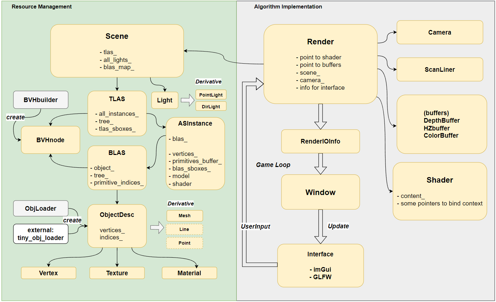

# 软光栅器和层次Z-Buffer的实现

# 1、项目概述

## 1.1 功能及代码结构概述

项目从底层实现了一个基础的软光栅器，在cpu端实现实时渲染。支持扫描线转换、层次zbuffer等剔除算法，采用BVH算法挖掘景物空间的连贯性，具体功能包括：

- 借助GLFW和OpenGL后端，搭建了实时可交互的windows界面。界面支持用户自定义相关渲染设置，如：渲染算法、shader种类、场景文件、bvh加速结构的可视化、bvh细粒度定义，上述修改均支持实时更新与反馈；界面会实时反馈每一帧的渲染开销等信息。
- 实现渲染管线。采用类OpenGL的状态机思想管理渲染管线的上下文，管线主要分为几何处理和光栅化阶段。其中几何处理阶段负责：MVP矩阵变换、背面剔除、视锥体裁剪算法，实现模型到屏幕空间的稳定的映射；光栅化阶段根据遍历对象的顺序的不同，分为顺序遍历和基于BVH结构启发式遍历两种方式，不同的渲染算法对应交互界面中的Naive、Bvh_hzb、Easy_hzb、Scan_convert四种选项。
- 实现了obj模型文件和纹理数据的读取和管理，采用BVH双层加速结构管理场景文件。所谓双层加速的BVH结构，其中底层加速结构(BLAS)管理唯一的obj模型，同一BLAS可以实例化为不同的对象（Instance），而顶层加速结构（TLAS）管理所有实例对象的所有属性。该结构一方面实现同一obj模型的内存复用，另一方面避免BLAS的冗余构建，且便于实时交互时的Instance属性动态更新。
- 实现多种基础的fragment shader，可渲染深度图、法向图、blinn-phone、线框图等，采用类似g-buffer的方式渲染多光源图。
- 实现不同的剔除算法。本项目的层次zbuffer算法能利用BVH的启发式遍历顺序，有效挖掘景物空间的连贯性，从而快速拒绝大量被遮挡景物。BVH结构在世界空间构建一次，随后实时渲染中只需基于相机视角视角，预先轻量维护屏幕空间的各个BVH结点的AABB盒，以支持实时的层次z-buffer算法。随后在光栅化阶段，总是选择屏幕空间z值更小的BVH节点作为优先遍历对象，以较大的期望近似层次z-buffer中的近到远的更新顺序。

项目界面图:


---

项目的结构及各文件的主要作用说明如下：

```cpp
SOFTRASTERIZER
├── assets                    // 模型文件和图片等资产
│   └── model/ 
├── bin                       // 编译输出(after compilation)
│   └── ...
├── build                     // 工程文件等(after compilation)
│   └── ...
├── external                  // 第三方库
│   └── ...
├── src                       // 项目源代码
│   ├── common                // 公共结构、工具函数等
|   │   └── ...
│   ├── softrender            // 软光栅器的核心渲染文件
|   │   ├── clipper.cpp       // 裁剪算法
|   |   ├── interface.cpp     // 实现 game loop
|   |   ├── interface.h       // 渲染管线与窗口的交互信号
|   |   ├── render.cpp
|   |   ├── render.h          // 项目的顶层类，管理pipeline状态
|   |   ├── scanline.cpp  
|   |   ├── scanline.h        // 扫描线转换算法
|   |   ├── shader.cpp
|   |   └── shader.h          // Vertex shader和Fragment shader
│   ├── as.h                  // 加速结构的声明      
│   ├── buffer.h              // 帧缓存和深度缓存 
│   ├── bvhbuilder.h          // bvh构建的具体实现   
│   ├── camera.h              // 相机
│   ├── hzb.h                 // 层次zbuffer
│   ├── light.h               // 光源定义
│   ├── main.cpp
│   ├── material.h            // 材质定义
│   ├── object.h              // 描述物体    
│   ├── scene_loader.h        // 场景管理的顶层类
│   ├── scenedemo.cpp         // 场景demo数据
│   ├── texture.h             // 纹理定义
│   ├── vertex.h              // 顶点定义
│   ├── window.h              // 可视化窗口定义
│   └── *.cpp                 // 许多cpp实现
├── CMakeLists.txt
├── setup_debug.bat
└── setup_release.bat
```

## 1.2 交互说明

直接运行程序后，可看到上图中展示的界面。

- 视角变换：鼠标左击屏幕可以移动摄像头视角；键盘WASD控制相机位置上下左右移动。
- 渲染属性调整：界面左下方的“Render Setting”中提供了部分目前可修改的值，用户可直接上手尝试。其中：
    - “Show TLAS”：展示顶层BVH结构；
    - “Show BLAS”：展示底层BVH结构；
    - “Leaf  size of BLAS” : 调整底层BVH的叶子节点至多包含的primitive数量；
    - “Demo Scene”：选择要渲染的demo场景；
    - “Rasterize Type”： 选择渲染算法；
    - “Shader Type”： 选择着色算法；
    - “Backface Culling”： 开关背面剔除；
    - “Profile Report”： 开关右侧性能指标；
- 渲染器实时性能变化：见右下方的“Performance Metrics”控件中的内容，包括：
    - 每一帧的帧率变化，以及pipeline各子阶段的计时器结果；
    - primitive的渲染情况分布，总的面数=渲染的面+背面剔除的面+被裁剪的面+HZB拒绝的面。可用于观测算法的实际性能。

## 1.3 开发环境说明

- 操作系统： windows11
- cpu型号： intel core i9
- 编译链：camke项目，支持多种编译链。本人开发中采用mingw64 v14.2.0版本的gcc和g++编译。
- 第三方库支持（见external文件夹）
    - glfw、glad、opengl：提供窗口构建和显示渲染，注意仅仅借助opengl将帧缓存绑定到矩形纹理中，最后渲染到窗口的viewport上，软光栅器未采用任何图形学接口；
    - glm：提供高效的矩阵和向量运算；
    - imgui: 通过即时渲染模式提供非常轻量和高效简易的图形界面，用来构建交互界面；
    - stb_image: 读取纹理数据的轻量库；
    - tiny_obj_loader: 读取obj格式模型的轻量库；

## 1.4 编译与运行

- windows

项目根目录下提供了windows的构建编译的脚本文件，直接在cmd窗口等windows终端中执行该脚本文件即可：

```cpp
cd path/to/project root
setup_release.bat          // 执行cmake等指令，需要先安装cmake环境
bin/srender                // 执行程序
```

- linux

```cpp
cd path/to/project root
mkdir build
cd build
cmake -DCMAKE_BUILD_TYPE=Release  -DCMAKE_C_COMPILER=/path/to/gcc -DCMAKE_CXX_COMPILER=/path/to/g++    ..
cmake --build .      // or: make ..
../bin/srender
```

看到根目录下有了bin文件夹，且其中生成目标可执行程序即编译成功。

# 2、 主要数据结构

下图简要展示了项目中主要的类，以及它们各自主要的数据成员。左侧（绿色）的各类负责场景文件的读取、场景资源的管理和场景加速结构的构建。右侧（灰色）的各类负责渲染管线的实现。更多细节请查看doc下的说明~




# 3、算法性能分析

## 3.1 渲染结果图展示

- 不同着色程序


- 层次结构可视化


- 裁剪算法可视分析


## 3.2各算法在多场景下的性能对比分析

> 统计不同测试算法在不同数量级面片数下，执行一遍完整管线的帧渲染平均开销(ms)
> 

测试环境：release模式，1024*1024分辨率；shader种类为normal；Leaf size of BLAS =12；统一视角。

| 算法\面片数 | 5k | 10k | 60k | 100k | 150k |
| --- | --- | --- | --- | --- | --- |
| naive 模式 | 16.61 | 16.68 | 21.97 | 33.00 | 34.95 |
| 扫描线转换 | 16.64 | 16.67 | 19.80 | 29.17 | 36.80 |
| 层次zbuffer-简易 | 16.87 | 16.68 | 24.70 | 25.56 | 28.60 |
| 层次zbuffer-完整 | 16.64 | 16.79 | 18.02 | 26.32 | 26.43 |

naive模式为不采用层次zbuffer且不采用扫描线转换，直接利用重心坐标插值熟悉。层次zbuffer简易模式不结合BVH，层次zbuffer完整模式则结合BVH。由上表可初步分析各算法在不同场景规模下的性能，在面片数量较少时（<60k），各算法的差异不明显，基本保持一致。当面片数较大时，此时层次zbuffer展示出优势，比如150k时层次zbuuffer在扫描线转换和naive模式的基础上提升了30%。当场景中深度复杂度继续提升时，可预见其性能优势将进一步扩大。

> 统计渲染管线各阶段的每一帧的平均开销(ms)
> 

测试环境：release模式，1024*1024分辨率；Leaf size of BLAS =12；以层次zbuffer为例；统一视角。

| 算法\面片数 | 5k | 10k | 60k | 100k | 150k |
| --- | --- | --- | --- | --- | --- |
| obj模型导入 | 0.9 | 1.4 | 2.0 | 2.7 | 2.9 |
| 几何处理阶段 | 0.35 | 0.67 | 2.9 | 7.20 | 8.57 |
| bvh结构更新 | 0.10 | 0.13 | 0.73 | 0.95 | 1.90 |
| 光栅化-depth | 8.92 | 11.91 | 14.50 | 20.21 | 25.62 |
| 光栅化-normal | 7.60 | 11.30 | 13.20 | 20.43 | 23.56 |
| 光栅化-frame | 0.50 | 0.95 | 4.3 | 5.20 | 9.80 |
| 光栅化-blinnphone单光源 | 14.40 | 20.38 | 20.40 | 30.72 | 38.74 |

对于每一帧的渲染，主要的开销在于光栅化着色。如果要进一步优化，可以考虑从多线程并行着色入手，按照屏幕划分tile分别进行着色，也可将着色函数直接封装成cuda核函数进行加速。

> 层次Z-buffer完整模式的有效性
> 

对于同一场景，完整版的层次zbuffer在某些视角下可以表现得更好。比如场景中有一堵墙和一只兔子，从墙后看可以直接将兔子的所有面片都剔除。而从墙前看则无法剔除，这是由算法中由前往后的遍历顺序决定的。观察下图中Shaded Faces和HZB Culled Faces的数量，以及帧率变化，可以发现层次Zbuffer能够有效挖掘景物空间的连续性，从而实现“快速拒绝”。


